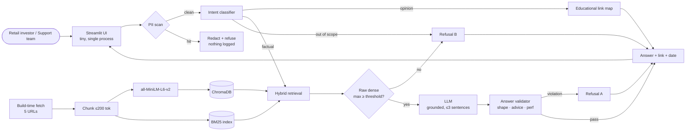
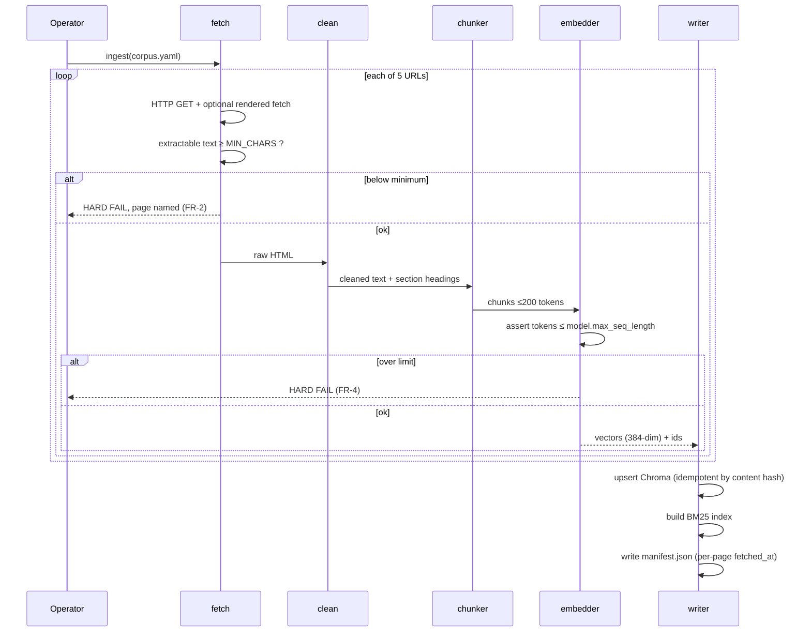
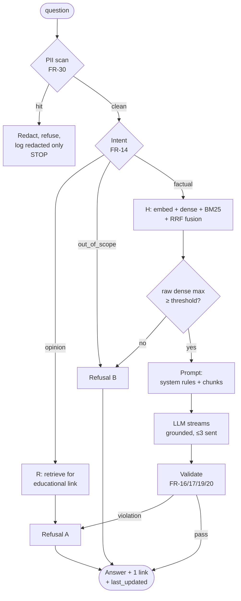
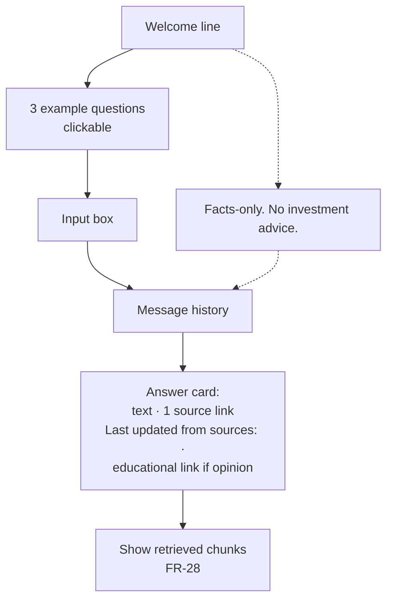

# Architecture — Mutual Fund FAQ Assistant

| Field | Value |
| --- | --- |
| **Document** | Technical Architecture, **v0.2** |
| **Supersedes** | v0.1 (course chatbot) — **void** |
| **Derived from** | `docs/PRD.md` v0.2 |
| **Source of truth** | `docs/problemstatement.txt` |
| **Mandated by source** | `all-MiniLM-L6-v2` · ChromaDB · loading → chunking → embedding → storage |

---

## 1. Design Position

This system's product value is **restraint**. It answers five HDFC scheme pages and nothing else, shows its source and its source's age, and declines to advise or to compare returns. Every architectural choice below is judged by one question:

> *Does this make a wrong financial fact harder to emit, and a correct refusal easier to produce?*

Latency and polish are secondary. A slightly slow app that refuses correctly beats a fast one that recommends a fund.

**The three load-bearing decisions, in order of importance:**

1. **Prohibitions are validated on output, not prompted** (§7.4). "No advice", "no performance claims", "≤3 sentences" are constraints on what leaves the building. Prompt instructions are the first line of defence, never the control.
2. **Intent is classified before retrieval is scored** (§6.1). Advice-seeking questions retrieve *strong* context. A similarity threshold cannot catch them, so it isn't asked to.
3. **No chunk may be silently truncated** (§4.4). This is the single mechanism by which the product would emit a confident, well-cited, wrong number.

---

## 2. System Context



**Egress:** one arrow leaves the machine — the LLM call. The corpus is public, so the only sensitivity is PII, and PII is stopped *before* that arrow (§8).

---

## 3. Component Map

Two paths: **build-time ingest** and **per-request query**. Asymmetric on purpose — ingest is batch and fail-closed; query is a bounded, serial pipeline with no loops and no tools.

| Module | Responsibility | Must not |
| --- | --- | --- |
| `core/config.py` | Typed settings from env | Contain logic |
| `core/models.py` | `Chunk`, `PageManifest`, `Answer`, `SourceRef`, `Intent`, `GateDecision` | — |
| `core/errors.py` | Typed error taxonomy | Swallow failures |
| `ingest/fetch.py` | URL → raw text; hard gate on extractable volume (FR-2) | Continue past an empty page |
| `ingest/clean.py` | Strip nav, footer, cookie chrome, boilerplate | Emit zero-length pages |
| `ingest/chunker.py` | Recursive structural split, ≤200 tokens (FR-3/4) | Split mid-fact when avoidable |
| `ingest/embedder.py` | Batched MiniLM embedding; **truncation assertion** (FR-4) | Allow silent truncation |
| `ingest/writer.py` | Idempotent upsert to Chroma + BM25 + manifest | Duplicate chunks on re-run |
| `safety/pii.py` | Detect + redact PAN/Aadhaar/account/OTP/email/phone (FR-30…33) | Log raw input |
| `retrieval/intent.py` | `factual` \| `opinion` \| `out_of_scope` (FR-14) | Depend on similarity scores |
| `retrieval/dense.py` | Chroma cosine query; returns **raw** scores | Decide relevance |
| `retrieval/sparse.py` | BM25 keyword query | — |
| `retrieval/fusion.py` | Reciprocal-rank merge (FR-11) | Produce thresholdable scores |
| `retrieval/gate.py` | Confidence gate on **raw dense** score (FR-13) | Be bypassable by the model |
| `education/links.py` | Verified educational-link lookup for opinion refusals (FR-21) | Return an unverified URL |
| `generation/prompts.py` | System rules + context assembly | Be the only enforcement |
| `generation/llm.py` | Provider adapter, streaming, retries — **single egress** | Know about chunks or PII |
| `generation/validate.py` | Sentence count, URL, advice screen, perf screen (FR-16…20) | Be advisory |
| `generation/educational.py` | Opinion-refusal phrasing + link attachment (FR-22) | Emit advice |
| `ui/app.py` | Streamlit: welcome, 3 starters, disclaimer, sources, chunk inspector | Call providers directly |
| `eval/` | Sample-set runner, judge, deterministic checks, threshold sweep | — |

**Boundary rule:** `generation/llm.py` knows nothing about chunks; `retrieval/*` knows nothing about the LLM. Both are testable with fakes, which is what makes the eval harness cheap and the ≤3-command run possible.

---

## 4. Build-Time Ingestion

### 4.1 Sequence



### 4.2 The fetch gate (FR-2) — first thing to build

**Groww is a client-rendered app.** A plain HTTP GET may return a JavaScript shell with almost no readable text. This is the most likely reason the project stalls, so it is gated *before* any other work (milestone M0):

- Minimum extractable character count per page, checked before anything else.
- Below minimum → **named hard failure** listing the page, not a warning.
- If plain fetch fails, a rendered-fetch fallback (headless browser) is required before proceeding.
- Each page's raw extract is persisted so re-parsing needs no re-fetch.

Rationale for a hard stop rather than a per-file skip: with 5 pages, losing one silently means the assistant confidently lacks a whole scheme. That is a *product* failure, not a build nuisance — and it is invisible until a user asks about the missing scheme.

### 4.3 Cleaning

Remove: nav, header, footer, cookie/consent banners, sidebar, promotional modules, breadcrumb chrome, share widgets. Preserve: scheme name, category, all numeric fields, tables (serialised row-wise so BM25 can match a cell), riskometer text, benchmark text, FAQ blocks, headings.

**Tables are the corpus.** Expense ratios, exit-load grids and SIP minimums are tabular. Each row becomes its own chunk unit with the table's caption prepended, so a retrieved chunk is a self-contained fact rather than a fragment needing neighbouring context. This also happens to suit the 256-token ceiling.

### 4.4 Chunking and the truncation gate (FR-4)

| Setting | Value | Reason |
| --- | --- | --- |
| `CHUNK_SIZE` | **200** tokens | Under the embedder ceiling with headroom |
| `CHUNK_OVERLAP` | **40** tokens | Protects facts straddling a boundary (~20 %) |
| Ceiling | read from `model.max_seq_length` | **Never hardcode 256** — read the loaded model's config so a model swap cannot silently break the guarantee |

Split priority: heading → list/table row → paragraph → sentence. Never split mid-sentence unless a single sentence exceeds the budget.

**The hard gate.** `sentence-transformers` **silently truncates** anything past `max_seq_length` — no exception, no warning. The consequence here is specific and severe: a chunk whose exit-load table sits past the limit is embedded with its tail missing, retrieval returns it as a *strong* match, and the model answers from a fact that was never in the vector. A hallucination wearing a real citation — precisely what FR-15, FR-20 and the source's no-performance-claims rule exist to prevent.

```python
# ingest/embedder.py  (illustrative)
def _assert_no_truncation(chunks: list[Chunk]) -> None:
    ceiling = self._model.max_seq_length          # read, never hardcoded
    for c in chunks:
        n = len(self._tokenizer.encode(c.text))
        if n > ceiling:
            raise ChunkTooLongError(chunk_id=c.chunk_id, tokens=n, ceiling=ceiling)
```

Non-bypassable, fails the build, names the chunk. A log line is not sufficient — this is a correctness invariant, and NFR-10 requires it be structurally impossible to violate.

### 4.5 Idempotency (FR-6)

Unit of change detection is the **page**, keyed by `sha256(cleaned_text)`.

| Situation | Action |
| --- | --- |
| Hash unchanged | Skip — no embed calls, no cost |
| Hash changed | Delete that page's chunks, re-embed, replace |
| New page | Ingest |
| Page removed from `corpus.yaml` | Purge its chunks next run |

Chunk ids are `sha256(page_id + ordinal)`, so upserts are naturally idempotent and a changed page leaves no orphans. Content drift (OD-5) is handled by re-running ingest; `fetched_at` moves forward only for pages actually re-fetched.

### 4.6 Manifest (FR-8, FR-9)

```json
{
  "generated_at": "2026-09-27T10:00:00Z",
  "amc": "HDFC Asset Management",
  "embedding_model": "sentence-transformers/all-MiniLM-L6-v2",
  "embedding_dim": 384,
  "chunk_size": 200, "chunk_overlap": 40,
  "pages": [
    { "page_id": "hdfc-large-cap", "scheme": "HDFC Large Cap Fund – Direct Growth",
      "category": "Large Cap",
      "source_url": "https://groww.in/mutual-funds/hdfc-large-cap-fund-direct-growth",
      "fetched_at": "2026-09-27T09:41:12Z",
      "chunks": 34, "content_hash": "…" }
  ],
  "totals": { "pages": 5, "chunks": 171, "failed": 0 }
}
```

**Why per-page `fetched_at` is load-bearing:** the source mandates `Last updated from sources:`. A single global index date would be a lie whenever pages were re-fetched at different times, and the whole point of the field is to let a user judge staleness of a number they may act on.

**Fail-closed UI:** if `totals.chunks == 0` or fewer than 5 pages loaded, the input box is disabled with an actionable message. Never let a user ask questions against a partial corpus and conclude the assistant is broken.

---

## 5. Retrieval

### 5.1 Hybrid by default (FR-11)

The question set is **exact numeric lookup**: `1.12%`, `0%`, `3 years`, `₹500`, `Nifty 50`, riskometer `Level 4`. Dense retrieval is weak on precise numerics and dates; BM25 is strong on them. Promoted from v0.1's stretch item to a must.

```
query ─┬─ embed (MiniLM) ────► Chroma cosine ──► top-20 ─┐
       └─ tokenize ──────────► BM25 ─────────► top-20 ──┴─► RRF(k=60) ──► top-k
```

`k=5` default, `top-20` pre-fusion, RRF constant 60. No score normalisation across the two scales — which is exactly why the gate must not read a fused score.

### 5.2 The confidence gate (FR-13) — raw dense only

Carried forward from v0.1's correction, unchanged in substance:

> The gate reads the **raw maximum cosine similarity from the dense retriever, before fusion**. RRF produces scale-free rank scores, not similarity. A query where every page is a poor match and one where every page is an excellent match can yield identical fused scores. A threshold on a fused score is not calibratable.

`retrieval/gate.py` therefore takes raw dense similarity as a **separate, explicitly-typed argument**, so it cannot later be "simplified" into reading a fused score.

**No default threshold is published.** Cosine ranges differ per model *and* per corpus; any number written down now would be invented. `eval/calibrate.py` sweeps thresholds over the sample set and reports the accuracy-versus-false-answer trade-off. **Calibrating this is a deliverable, not a config tweak.**

**Known limitation, stated plainly:** a single global threshold is blunt for short, dense numeric chunks, which legitimately score low. If M-3 passes but M-1 misses, this gate is the first thing to revisit — per-intent thresholds, or a lower threshold with a stronger "not in corpus" prompt.

---

## 6. Query Path

### 6.1 Order of operations — the critical sequence



**Three gates, in this order, each catching a failure the others cannot.**

### 6.2 Gate 1 — PII (FR-30…FR-33)

Runs **first**, before embedding, before the LLM, before any log write. Regex plus checksum validation for PAN and Aadhaar; pattern matching for account numbers, OTPs, emails, phone numbers.

On detection: mask the spans, return a neutral "please remove personal details" message, and write **only the redacted question** (or a hash) to logs. Nothing is embedded, sent, or persisted.

This ordering is the entire point. A PII filter that runs after the LLM call has already violated the source's constraint.

### 6.3 Gate 2 — intent (FR-14)

| Intent | Signals | Handling |
| --- | --- | --- |
| `factual` | expense ratio, exit load, SIP, lock-in, benchmark, riskometer, statement download | Proceed to retrieval |
| `opinion` | should I, buy, sell, invest, best, better, recommend, allocate, portfolio, switch, worth it | **Refusal A** + educational link |
| `out_of_scope` | other AMCs, non-corpus schemes, tax/legal/financial planning | **Refusal B** |

Implemented as a lightweight classifier: a scored keyword/phrase rule set with a small LLM fallback for phrasings the rules miss. Rules first because they are auditable, deterministic, and cheap — and because "should I buy" must never depend on a fuzzy model judgement.

**Why this cannot be folded into the confidence gate.** "Should I buy HDFC Large Cap for 5 years?" retrieves *excellent* context — those pages are dense with returns, ratios and fund characteristics. The top dense score will be high. A threshold sees a confident match and passes it to generation, where the model helpfully discusses whether the fund suits a 5-year goal. This is the most probable serious failure of a naive build, and the reason intent is a separate stage evaluated *before* retrieval scoring.

### 6.4 Refusal A — opinion, with an educational link (FR-21, FR-22)

The source requires a **relevant educational link**, so a fixed string is insufficient. This path *does* run retrieval — but for educational material, not scheme facts.

`education/links.py` maps an intent topic to a **human-verified official URL**:

```yaml
# data/education_links.yml — SCHEMA ONLY. Entries must be added by a human
# after opening and verifying each URL. Do not fabricate, infer, or
# pattern-match links; an unverified URL in an educational position is
# worse than no link at all.
version: 1
entries: []
#  - topic: <intent topic tag>
#    url: <verified official URL — AMC / SEBI / AMFI investor education>
#    title: <page title>
#    verified_on: <YYYY-MM-DD>
#    verified_by: <name>
```

**⚠️ OD-2 is unresolved and blocks this path.** The sanctioned corpus is 5 *commercial scheme pages*, which are not educational content. Two viable resolutions: a curated verified link map, or adding AMC/SEBI investor-education pages to the corpus under source line 27's allowance. Either way, **every URL must be opened and verified by a human.** Generating plausible-looking Groww or SEBI URLs is the single easiest way to ship something that looks finished and is actively wrong — and it is the failure mode most likely to survive review, because the links would render fine.

Interim behaviour until resolved: refuse with the educational link omitted, and mark the response `educational_link_missing: true` so M-3 reports honestly rather than passing on a broken link.

### 6.5 Refusal B — not in corpus

Fixed string, **no LLM call**, deterministic and free. States the facts-only boundary once, names what the corpus covers, and does not apologise or moralise. Never reveals thresholds, scores, or chunk contents.

### 6.6 Gate 3 — answer validation (FR-16…FR-20)

Prohibitions are checked on the **output**:

| Check | Rule | On failure |
| --- | --- | --- |
| Sentence limit | ≤3 sentences, counted post-generation | Regenerate once, then trim |
| Citation | exactly one URL, must be in the corpus **and** among retrieved chunks | Strip invented URLs, resolve from provenance, fall back to listing retrieved sources |
| Freshness | `last_updated` = the cited page's `fetched_at` | Re-derive from provenance |
| **Advice screen** | buy/sell/should/recommend/suggest/allocate/portfolio/you should | **Convert to Refusal A** |
| **Performance-claim screen** | return/returns/CAGR/NAV/yield + period figures (`1-year`, `3-year`) and return-shaped numbers | **Refuse + official factsheet link** |
| Grounding | every claim traceable to a cited chunk | Refuse |

**The performance screen needs care.** Expense ratio is a percentage but is a *fee*, not a return; blocking percentages wholesale would break the core question type. The pattern set therefore targets *return-shaped* figures — NAV values, CAGR, and period-attached percentages — and is validated against the sample set before submission.

Validation runs post-stream; a violation is converted server-side, so a prohibited answer is never displayed even transiently. Defences are layered on purpose: the prompt asks, the validator guarantees, the sample set proves (FR-35).

### 6.7 Answer contract

```python
# core/models.py  (illustrative)
class Intent(str, Enum):
    factual = "factual"; opinion = "opinion"; out_of_scope = "out_of_scope"

class Answer(BaseModel):
    intent: Intent
    text: str                                   # validated ≤3 sentences
    source_url: str | None                      # exactly one, in-corpus
    source_title: str | None
    last_updated: datetime | None               # the cited page's fetched_at
    is_advice: bool = False                     # validated
    perf_claim: bool = False                    # validated
    educational_link: str | None = None         # required when intent is opinion
    educational_link_missing: bool = False      # honest reporting while OD-2 is open
    refused: bool = False
    retrieved_chunk_ids: list[str] = []         # UI inspector only
    validation: list[str] = []                  # which checks ran / were adjusted
```

`validation` and `educational_link_missing` are not decoration. They make the eval harness able to distinguish "correctly refused" from "refused because the link map is empty", which is the difference between a real M-3 pass and a false one.

### 6.8 Latency budget (NFR-1, NFR-2, NFR-4)

| Stage | Target | Note |
| --- | --- | --- |
| PII scan | < 5 ms | Regex only |
| Intent classify | < 20 ms | Rules path; LLM fallback ~300 ms |
| Query embed (local MiniLM) | 10–40 ms | CPU, no API |
| Chroma cosine | 5–30 ms | Local, in-process |
| BM25 | 2–10 ms | In-memory |
| Fusion + gate | < 2 ms | Pure CPU |
| Prompt assembly | < 5 ms | Pure CPU |
| **→ first token** | **~0.1–0.4 s** (API) / ~0.5–1.5 s (local) | |
| Generation | 1–5 s | Concision instructed |
| Validation | < 10 ms | Deterministic |
| **→ end to end** | **~1.5–6 s** | Comfortably inside NFR-1's 6 s median |
| Retrieval-only | **< 100 ms** | Inside NFR-4's 500 ms |

**Local embeddings remove the embedding API call entirely** — the retrieval path is now fully offline, and only generation touches the network. Reported as **median and max over the 8-query sample set (n=8)**, never p95: 8 samples cannot support a percentile (PRD §9.4).

**Omitted deliberately:** no reranker, no query cache, no speculative retrieval. A cross-encoder would improve fact accuracy for ~200 ms but adds a model dependency and a second failure mode for a gain invisible in a 3-minute demo. Recorded as the top post-submission improvement.

---

## 7. UI

Single Streamlit process. **No separate API server** — the source asks for a "tiny UI" and permits an app *or* a notebook, and one process is one fewer thing to fail on demo day while satisfying NFR-11.



Required elements: welcome line; exactly 3 starters (FR-24); the persistent facts-only note (FR-25); per-answer source link and date (FR-26); educational link on opinion refusals (FR-27); chunk inspector (FR-28); clear (FR-29).

Binds to `127.0.0.1` only. No auth, no persistence across restarts — consistent with §2.4.

**The chunk inspector is the credibility device.** In a product whose whole claim is "this is grounded, and I won't advise", showing the exact retrieved evidence in one click is worth more than any amount of UI polish. It is S-priority, and the first item in the cut order.

---

## 8. Safety

### 8.1 PII (FR-30…FR-33)
Pipeline position is the control: **scan → redact → then everything else**. Regex + checksum for PAN and Aadhaar; patterns for account numbers, OTPs, emails, phones. On hit: mask, refuse, log redacted-or-hashed only. Nothing embedded, sent, or persisted.

### 8.2 Prompt injection
The corpus is public third-party content we do not control, so unlike v0.1's owned course files this warrants explicit handling:

- Retrieved text is delimited and explicitly labelled untrusted data.
- The system prompt forbids following instructions found inside context.
- **The validators sit downstream of the model**, so a successful injection still cannot emit an uncited, unchecked answer.

Residual risk, documented not solved: injected text could bias phrasing. Full mitigation is out of scope.

### 8.3 Data handling
No PII stored anywhere — Chroma, BM25 index, logs, and `feedback` (if enabled) are all covered by FR-32. Keys in env only (NFR-13). One egress point, `generation/llm.py` (NFR-14).

---

## 9. Repository Layout

```
27/
├── docs/
│   ├── problemstatement.txt      # source of truth
│   ├── PRD.md                    # v0.2
│   ├── architecture.md           # this file
│   └── validation-report.md
├── config/
│   ├── corpus.yaml               # AMC + 5 schemes + URLs
│   └── education_links.yml       # verified links only — SCHEMA UNTIL OD-2 RESOLVED
├── data/
│   └── raw/                      # fetched page extracts (persisted, re-parsable)
├── src/ragbot/
│   ├── core/       config.py  models.py  errors.py  logging.py
│   ├── ingest/     fetch.py  clean.py  chunker.py  embedder.py  writer.py  __main__.py
│   ├── safety/     pii.py
│   ├── retrieval/  intent.py  dense.py  sparse.py  fusion.py  gate.py
│   ├── education/  links.py
│   ├── generation/ prompts.py  llm.py  validate.py  educational.py
│   ├── ui/         app.py
│   └── eval/       runner.py  judge.py  checks.py  calibrate.py
├── artifacts/
│   ├── manifest.json
│   ├── source_list.csv  source_list.md          # D-2
│   ├── sample_qa.md                             # D-4
│   ├── eval_report.md
│   └── demo_script.md
├── tests/          unit/  integration/  fixtures/  pii_cases/
├── .env.example    # checked in, no real values
├── .env            # gitignored
├── Makefile        # setup · fetch · ingest · run · eval · calibrate · test
├── requirements.txt
└── README.md       # D-3
```

---

## 10. Build Order

| Step | Delivers | Stands alone because |
| --- | --- | --- |
| 0. **Corpus spike** | All 5 pages fetched; each yields text; 7 question types audited | Can invalidate the plan. Nothing else should start first |
| 1. Ingest | Fetch → clean → chunk → embed → Chroma, with manifest and truncation gate | Proves parsing; cheapest place to find extraction problems |
| 2. Retrieval | CLI prints retrieved chunks; dense vs hybrid compared | Retrieval tuned with no LLM in the loop — fast and free to iterate |
| 3. Intent + generation + validation | CLI returns contract-valid answers and both refusal types | Core claims proven headlessly; no UI risk |
| 4. PII | Battery passes; nothing persisted | Independent, parallelisable |
| 5. Eval + calibration | Sample Q&A, metrics, threshold sweep | Produces the numbers the demo quotes |
| 6. UI | Streamlit page | Presentation only; cannot break correctness |
| 7. Deliverables | All 5 artefacts, demo recorded | — |

**Step 2 before step 3 is deliberate.** Tuning retrieval while iterating on generation confounds two variables. And a CLI that prints chunks is both the best debugging tool in the project and the honest fallback if the UI breaks during the demo.

**Cut order:** chunk inspector (FR-28) → clear (FR-29) → BM25 (dense-only fallback) → UI polish.
**Never cut:** the fetch gate (FR-2) · the truncation gate (FR-4) · intent classification (FR-14) · output validation (FR-19/20) · the PII layer (FR-30…33) · the sample set (FR-34). These carry the source's prohibitions. Everything else is presentation.

---

## 11. Key Decisions

| # | Decision | Rejected | Why |
| --- | --- | --- | --- |
| AD-1 | `all-MiniLM-L6-v2` | `text-embedding-3-small` | **Mandated** (source 16/20/52). Also removes the embedding API dependency |
| AD-2 | ChromaDB | Any hosted vector DB | **Mandated** (18/54). Also keeps retrieval fully local |
| AD-3 | Hard truncation assertion at embed time | Rely on the library's truncation | Silent truncation is the exact path to a well-cited wrong number |
| AD-4 | Intent stage before retrieval scoring | Fold into the confidence gate | "Should I buy?" retrieves strong context; a threshold cannot catch it |
| AD-5 | Prohibitions validated on output | Prompt-only enforcement | They are constraints on what ships, not style hints |
| AD-6 | Refusal B fixed string, no LLM | Model-generated refusal | Deterministic, free, identical every run |
| AD-7 | Refusal A retrieves a link | Fixed string for both refusals | The source explicitly requires a *relevant* educational link |
| AD-8 | Educational links from a human-verified map | Generate or infer URLs | An invented URL in an educational position is worse than none |
| AD-9 | Citations from chunk provenance | Trust model-emitted URLs | Makes an invented citation structurally impossible |
| AD-10 | Hybrid retrieval on by default | Dense only | Exact numeric lookups; BM25 wins on `1.12%`, `3 years` |
| AD-11 | RRF fusion | Score normalisation / weighted blend | No calibration needed across incomparable scales |
| AD-12 | Gate on **raw dense** score, pre-fusion | Gate on fused score (v0.1 PRD) | RRF scores are scale-free and unthresholdable |
| AD-13 | Single Streamlit process, no API server | FastAPI + Streamlit | "Tiny UI" (37); one process satisfies NFR-11 with less to break |
| AD-14 | Minimal framework use, retrieval logic ours | Full LangChain agent | Determinism, debuggability; v0.1's reasoning holds |
| AD-15 | PII scan before embedding | PII filter after the LLM call | After the call, the constraint is already violated |
| AD-16 | Per-page `fetched_at` | Global index date | Makes "last updated" truthful under partial re-fetch |
| AD-17 | No reranker | Cross-encoder rerank | Best post-submission win; excluded to avoid a second model dependency |
| AD-18 | Loopback bind, no auth | Adding auth | Out of scope (§2.4); loopback is proportionate |

---

## 12. Requirement Traceability

Every `FR-*` from PRD v0.2 maps to a module. No unmapped requirements.

| FR | Component | Verified by |
|---|---|---|
| FR-1, FR-2 | `ingest/fetch.py` | Fetch log; empty-page gate test |
| FR-3 | `ingest/chunker.py` | Chunk dump review |
| FR-4 | `ingest/embedder.py` §4.4 | Oversized-fixture assertion test |
| FR-5 | `ingest/chunker.py` | Provenance test |
| FR-6, FR-7 | `ingest/writer.py` | Double-run idempotency test |
| FR-8, FR-9 | `writer.py` + `manifest.json` | Manifest snapshot; two-dates test |
| FR-10 | `retrieval/dense.py` | Sample Q&A |
| FR-11 | `retrieval/sparse.py` + `fusion.py` | Dense-only vs hybrid comparison |
| FR-12 | `core/config.py` | Config test |
| FR-13 | `retrieval/gate.py` | Unanswerable row in sample set |
| FR-14 | `retrieval/intent.py` | Opinion rows in sample set |
| FR-15 | `generation/prompts.py` | Groundedness audit |
| FR-16, FR-17, FR-19, FR-20 | `generation/validate.py` | Invented-URL test; adversarial prompts |
| FR-18 | `writer.py` provenance → `validate.py` | Per-page date test |
| FR-21 | `education/links.py` | Link map review |
| FR-22 | `generation/educational.py` | Unit test |
| FR-23…FR-29 | `ui/app.py` | Screenshots; manual |
| FR-30…FR-33 | `safety/pii.py` | PII battery; log inspection |
| FR-34, FR-35 | `eval/` | `make eval` output |
| FR-36…FR-39 | repo root, `artifacts/` | Artefacts present |
| FR-40 | `eval/runner.py` | Re-run comparison |

**Coverage: all 40 FRs mapped.** Milestones M0–M7 follow PRD §14.

**v0.1's "unmapped: none" claim is replaced by this table rather than repeated as a slogan** — the check is re-runnable and the mapping is auditable per row.

---

## 13. Risks

| Risk | Severity | Mitigation |
| --- | --- | --- |
| Groww returns a JS shell; corpus empty | **Critical** | FR-2 hard gate at M0, before any build. Rendered-fetch fallback |
| Silent chunk truncation at 256 tokens → cited-but-wrong fact | **Critical** | FR-4 non-bypassable assertion; ceiling read from model config, not hardcoded |
| Model advises on "should I buy" | **Critical** | Two-stage intent gate (§6.3) + FR-19 output screen + M-4 = 0 |
| Model emits or compares returns | **Critical** | FR-20 screen + M-5 = 0 + factsheet link |
| Opinion refusals lack an educational link (OD-2) | High | Curated verified map or corpus extension. Interim: refuse with `educational_link_missing` reported honestly, never a fabricated URL |
| Capital-gains-statement question unanswerable (OD-4) | High | Extend corpus under line 27, or drop the question type and document it |
| MiniLM weak on table-heavy, long chunks | High | Row-wise table chunking; BM25 promotion; short chunks suit the ceiling |
| Corpus facts drift; stale number quoted | Medium | Per-page `fetched_at` (FR-9) + documented re-fetch cadence |
| PII reaches logs or storage | Medium | FR-30…33; scan-first ordering (AD-15); NFR-9 |
| Hosting unavailable | Low | Source permits a ≤3-min video (line 44); required artefact, not a fallback afterthought |
| LLM API unavailable on demo day | Medium | OD-1 local fallback; video as backstop |
| Third-party page content changes structure | Medium | Content-hash idempotency; re-run spike; corpus limited to 5 known pages |
| Scope creep toward recommendations | Low | §2.4 non-goals; advice prohibition is graded |

---

## 14. Open Decisions

Architecture-blocking, carried from PRD §17. Full detail there.

| ID | Decision | Blocks | Note |
| --- | --- | --- | --- |
| **OD-1** | Chat LLM — hosted or local? | NFR-12, NFR-15, demo risk | Source mandates **only** embeddings. The `LLMClient` adapter makes this config, not architecture |
| **OD-2** | Source of "relevant educational links" | §6.4, FR-21, M-3 | **Highest risk.** Corpus is commercial pages, not educational content. Human-verify every URL |
| **OD-3** | "One source link" — exactly one, or at least one? | FR-17 | §6.7 assumes exactly one |
| **OD-4** | Capital-gains-statement corpus gap | Corpus scope | PRD §2.3 |
| **OD-5** | Snapshot vs live; re-fetch cadence | FR-1, FR-9 | Ingest is build-time; `fetched_at` per page |
| **OD-6** | Language — English only? | Embedding model | `all-MiniLM-L6-v2` is **English-only**. If Hindi is required, escalate — the mandated model cannot serve it |
| **OD-7** | Hosting, or video as the deliverable? | FR-39 | — |
| **OD-8** | Is a notebook acceptable as the prototype? | §7 UI | A notebook could remove the UI layer |

---

## 15. Architecture Definition of Done

Strict subset of PRD §18. The PRD checklist is the single source of truth.

**Mandated architecture**
- [ ] `all-MiniLM-L6-v2` used for embeddings, no substitution
- [ ] ChromaDB used as the vector store
- [ ] All four RAG stages demonstrable end to end, plus retrieval
- [ ] Chunk ceiling read from model config; oversized chunk **fails the build**; zero silent truncations

**Prohibitions enforced structurally**
- [ ] PII scan runs before embed, before LLM, before any log write
- [ ] Intent classified before retrieval scoring
- [ ] A low-similarity query provably makes **zero** LLM calls (mock-based test)
- [ ] An opinion query provably never reaches generation
- [ ] An invented URL is stripped in a test, not merely described
- [ ] A return-shaped figure is blocked in a test
- [ ] An over-length answer is trimmed in a test

**Retrieval**
- [ ] Threshold calibrated by sweep, with the trade-off curve recorded
- [ ] Hybrid compared against dense-only on the sample set

**Traceability**
- [ ] All 40 FRs mapped in §12, re-runnable
- [ ] Every PRD open decision either resolved or named on the demo's limitations slide

---

*End of Architecture v0.2. Derived from `docs/PRD.md` v0.2 and `docs/problemstatement.txt`. Supersedes v0.1, which specified a different product and is void.*
